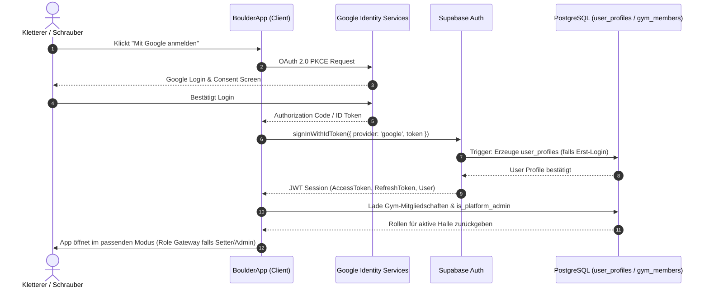

# SPEC-000: Authentifizierung, Rollen & Zugriffssteuerung (Login & Access Control)

## Status: APPROVED

## Summary
Definiert das fundamentale Authentifizierungs-, Identitäts- und Autorisierungs-System für BoulderApp ("Feature 0"). 
Es ermöglicht Nutzern einen barrierefreien Login via **Social Login (Google Sign-In, Apple)** sowie optional über E-Mail/Passwort oder Magic Link.
Das Berechtigungssystem folgt einem strikten, hybriden **Role-Based Access Control (RBAC)**-Modell mit lokaler **Hallen-Isolierung (Gym Scoping)**:
1. **Universeller Kletterer (Base Role)**: Jeder registrierte Nutzer ist **immer und ausnahmslos** ein Kletterer mit vollem Zugriff auf das Kletterer-Panel (Sektoren, Routen, Bewertungen, Logbuch, Statistiken).
2. **Hallenbezogener Schrauber (Gym Setter)**: Ein Nutzer kann Schrauber für eine spezifische Halle (z. B. "Minimum Zürich") sein – **jedoch ausschließlich für genau diese Halle**. Nur für diese Halle kann er das Schrauber-Studio betreten und Routen erfassen/veröffentlichen. In fremden Hallen ist er ein normaler Kletterer.
3. **Hallenbezogener Administrator (Gym Admin)**: Verwaltet die Stammdaten, Farbskalen und Sektoren seiner Halle(n). Kann registrierte Nutzer in seiner Halle zu Schraubern ernennen oder wieder abberufen sowie weitere Hallen-Admins für seine Halle ernennen.
4. **Plattform-Administrator / Superadmin (Platform Admin)**: Globale systemweite Rolle. **Ausschließlich Inhaber dieser Rolle dürfen neue Hallen im Gesamtsystem registrieren/anlegen**, das Hallen-Onboarding durchführen und den initialen Hallen-Admin einer neuen Halle bestimmen.

---

## Grill-Me Deep Dive & Architektur-Entscheidungen (ADR)

Im Rahmen des *Grill-Me*-Architektur-Reviews wurden kritische Kernfragen durchleuchtet, abgewogen und wie folgt entschieden:

### 1. Warum Google Login & Social Auth als Primärweg?
- **Grill-Frage**: *Warum nicht einfaches E-Mail/Passwort als Standard und Social Login optional?*
- **Entscheidung**: Kletterer nutzen die App primär am Smartphone in der Boulderhalle (mit Kreide an den Fingern, wenig Geduld für Passwort-Eingabefelder oder Verifizierungs-Mails). Ein 1-Tap-Google-Login (bzw. Apple Sign-In auf iOS) senkt die Onboarding-Hürde auf unter 5 Sekunden. E-Mail/Magic-Link bleibt als Fallback für Nutzer ohne Google/Apple-Konto verfügbar.
- **Technologie**: Supabase Auth (`@supabase/supabase-js`) mit OAuth 2.0 PKCE-Flow (Web) und nativem Credential Manager / Google Sign-In SDK (Mobile).

### 2. Universal Climber vs. Einladungsmodell
- **Grill-Frage**: *Muss ein Nutzer Mitglied einer Halle sein, um dort Routen anzusehen und zu loggen?*
- **Entscheidung**: **Nein.** Boulderer wechseln regelmäßig zwischen verschiedenen Hallen. Ein Kletterer ist systemweit berechtigt, jede öffentliche Halle zu besuchen, Routen anzuschauen, Tops/Flashes zu loggen und Feedback abzugeben. Kletterer-Rechte bedürfen keiner Freischaltung durch Hallenbetreiber. Jeder authentifizierte User ist `isClimber === true`.

### 3. Gym-Scoped vs. Globale Schrauber-Rechte
- **Grill-Frage**: *Warum gibt es keine globale "Schrauber"-Rolle im System?*
- **Entscheidung**: Routensetzer werden von einzelnen Hallenbetreibern angestellt, beauftragt oder vergütet. Ein Schrauber der Halle "Minimum Zürich" darf unter keinen Umständen Routen in "Gaswerk Schlieren" erfassen, bearbeiten oder löschen. Schrauber-Rechte sind daher zwingend an das Tupel `(user_id, gym_id)` gekoppelt. Beim Wechsel der aktiven Halle in der App passt sich der verfügbare Funktionsumfang (`canAccessSetterStudio`) sekundenschnell an.

### 4. Wer darf Hallen anlegen? (Plattform-Admin vs. Self-Service)
- **Grill-Frage**: *Warum dürfen normale Hallenbetreiber oder Kletterer nicht einfach selbst eine neue Halle per Button anlegen?*
- **Entscheidung**: Unkontrollierte Hallen-Erstellung führt unweigerlich zu Hallen-Duplikaten ("Minimum", "Minimum Boulder", "Minimum Zürich"), zersplitterten Routen-Datenbanken und Qualitätsproblemen. Neue Hallen dürfen **ausschließlich von Nutzern mit der Rolle `platform_admin` (Superadmin)** angelegt werden. Dies stellt sicher, dass offizielle Hallenbetreiber vorab verifiziert, Hallenstammdaten sauber gepflegt und der initiale Hallen-Admin autorisiert zugewiesen wird.

### 5. Ernennung von Hallen-Admins und Schraubern (Delegations-Kette)
- **Grill-Frage**: *Wie entsteht die Rechte-Kette vom System-Start bis zum Schrauber an der Wand?*
- **Entscheidung**:
  1. `Platform Admin` legt Halle an und ernennt `User X` zum initialen `Hallen-Admin` dieser Halle.
  2. `Hallen-Admin` kann in den Hallen-Einstellungen seiner Halle andere Nutzer per Nickname/E-Mail suchen und zu `Schraubern` für diese Halle ernennen.
  3. `Hallen-Admin` kann auch Vertretungs-Admins (weitere `Hallen-Admins` für dieselbe Halle) ernennen.
  4. Ein `Hallen-Admin` kann sich nicht selbst als letzten verbleibenden Admin der Halle degradieren (Schutz vor verwaisten Hallen).

### 6. Session-Handling, Token & Offline-Verhalten
- **Grill-Frage**: *Wie verhält sich die Rechteprüfung bei schlechtem Empfang in Boulder-Kellern?*
- **Entscheidung**: Supabase JWTs enthalten User-ID und Metadaten (`is_platform_admin`). Hallenspezifische Rollen werden beim App-Start geladen und in einem sicheren lokalen Store gecacht (`localStorage` / React Native MMKV). Ein Kletterer oder Schrauber kann offline weiterarbeiten; Schreiboperationen (z. B. Routenerfassung) werden lokal gepuffert und synchronisiert, sobald wieder Netzverbindung besteht.

---

## User Stories

- **US-1 (Google Login & Social Auth)**: Als Nutzer möchte ich mich mit einem Klick über mein Google-Konto anmelden können, damit ich ohne manuelles Registrierungsformular sofort startklar bin.
- **US-2 (Universeller Kletterer)**: Als jeder beliebige angemeldete Nutzer möchte ich sofort vollen Zugriff auf das Kletterer-Panel aller Hallen haben (Routen filtern, ansehen, Tops/Flashes loggen, bewerten, Profil führen), ohne dafür eine Freischaltung anfragen zu müssen.
- **US-3 (Hallenbezogener Schrauber)**: Als Schrauber für die Halle A möchte ich für Halle A das Schrauber-Studio öffnen und Routen erfassen können, während ich in Halle B ein ganz normaler Kletterer ohne Schrauber-Rechte bin.
- **US-4 (Schrauber ernennen)**: Als Hallen-Admin für Halle A möchte ich in meiner Hallen-Verwaltung registrierte Nutzer zu Schraubern für Halle A ernennen oder ihnen die Schrauber-Rolle wieder entziehen können.
- **US-5 (Hallen-Admin ernennen)**: Als Hallen-Admin für Halle A möchte ich einem vertrauenswürdigen Teammitglied ebenfalls die Rolle des Hallen-Admins für Halle A übertragen können.
- **US-6 (Hallen hinzufügen - Plattform-Admin)**: Als Plattform-Administrator möchte ich neue Boulderhallen im System anlegen und deren ersten Hallen-Admin festlegen können. Nicht-Plattform-Admins dürfen keine Hallen erstellen.
- **US-7 (Dynamischer Hallenwechsel & Role Gateway)**: Als Nutzer mit Schrauber-Rechten in Halle A, aber reinen Kletter-Rechten in Halle B, möchte ich beim Wechsel der Halle in der App sofort die jeweils zutreffenden Rollen und Arbeitsbereiche angezeigt bekommen.

---

## Acceptance Criteria

- [x] **AC-1 (Universelle Kletterer-Rolle)**: Jeder authentifizierte Nutzer besitzt immer die Basisrolle `climber` (`member`). Diese Rolle ist unverlierbar und gilt über alle Hallen hinweg.
- [x] **AC-2 (Google & Social Auth)**: 
  - Login-Modal bietet Anmeldeoption via Google OAuth 2.0 (`signInWithOAuth({ provider: 'google' })`).
  - Fallback-Option für E-Mail-Anmeldung.
  - Test-/Entwicklungs-Switcher zum sofortigen Wechseln zwischen repräsentativen Test-Personas ohne echtes OAuth.
- [x] **AC-3 (Automatisches User-Profil)**: Nach erfolgreichem Erst-Login wird automatisch ein Datensatz in `user_profiles` angelegt (ID, E-Mail, Nickname aus Google-Display-Name abgeleitet, Avatar-URL).
- [x] **AC-4 (Hallenbezogene Schrauber-Rolle `setter`)**:
  - Schrauber-Rechte sind strikt an `(gym_id, user_id)` gebunden.
  - Das Schrauber-Studio kann **nur** geöffnet werden, wenn der aktive Nutzer für die aktuell ausgewählte Halle die Rolle `setter` oder `admin` besitzt.
  - Beim Wechsel zu einer Halle, in der der Nutzer kein Schrauber ist, wird der Schrauber-Modus gesperrt und der Nutzer automatisch auf das Kletterer-Panel umgeleitet.
- [x] **AC-5 (Schrauber-Ernennung durch Hallen-Admin)**:
  - Ein Hallen-Admin kann in der Hallen-Verwaltung (`GymManagement`) seiner Halle Nutzer als Schrauber (`setter`) hinzufügen.
  - Ein Hallen-Admin kann Schrauber-Rechte für seine Halle jederzeit widerrufen.
  - Ein Hallen-Admin kann **keine** Schrauber für fremde Hallen ernennen.
- [x] **AC-6 (Hallen-Admin Ernennung & Schutz)**:
  - Ein bestehender Hallen-Admin kann einen anderen Nutzer zum `admin` für seine Halle ernennen.
  - Ein Hallen-Admin kann sich nicht selbst degradieren, wenn er der einzige verbleibende Admin dieser Halle ist (Lockout-Schutz).
- [x] **AC-7 (Plattform-Admin / Hallen-Erstellung)**:
  - Es existiert die globale Plattform-Rolle `is_platform_admin` (Superadmin).
  - Ausschließlich Nutzer mit `is_platform_admin === true` können neue Hallen im System registrieren (`createGym`).
  - Für reguläre Kletterer und reine Hallen-Admins ist der Button "Neue Halle anlegen" unsichtbar; Aufrufe der Backend-Logik werfen einen Berechtigungsfehler (`403 Forbidden`).
- [x] **AC-8 (Initialer Hallen-Admin)**:
  - Beim Anlegen einer Halle durch den Plattform-Admin wird ein initialer Hallen-Admin festgelegt (standardmäßig der Ersteller oder ein dedizierter Nutzer).
  - Der ernannte Nutzer erhält automatisch den Eintrag `role = 'admin'` in `gym_members` für diese neue Halle.
- [x] **AC-9 (Role Gateway Synchronisation)**:
  - Das Role Gateway (SPEC-006) bewertet die Berechtigungen basierend auf der **aktuell ausgewählten Halle**.
  - Besitzt der Nutzer in Halle A Schrauber-Rechte, sieht er im Gateway für Halle A den Button "Schrauber-Studio". Wechselt er zu Halle B, steht dort nur die Kletterer-App zur Verfügung.
- [x] **AC-10 (Row Level Security & API-Sicherheit)**:
  - SQL-Sicherheitsrichtlinien (RLS) verhindern unautorisierte Manipulationen auf Datenbankebene.

---

## Berechtigungs-Matrix (Role & Permission Grid)

| Aktion | Gast (nicht eingeloggt) | Kletterer (Universal) | Schrauber (für Halle X) | Hallen-Admin (für Halle X) | Plattform-Admin (Superadmin) |
|---|:---:|:---:|:---:|:---:|:---:|
| **Hallen & Sektoren durchsuchen** | ✅ (Lesezugriff) | ✅ | ✅ | ✅ | ✅ |
| **Boulder ansehen & filtern** | ✅ (Lesezugriff) | ✅ | ✅ | ✅ | ✅ |
| **Begehung loggen (Top / Flash / Projekt)** | ❌ (Login gefordert) | ✅ (alle Hallen) | ✅ (alle Hallen) | ✅ (alle Hallen) | ✅ (alle Hallen) |
| **Boulder bewerten (Grad, Sterne, Radar)** | ❌ (Login gefordert) | ✅ (alle Hallen) | ✅ (alle Hallen) | ✅ (alle Hallen) | ✅ (alle Hallen) |
| **Eigenes Profil & Logbuch verwalten** | ❌ | ✅ | ✅ | ✅ | ✅ |
| **Schrauber-Studio öffnen** | ❌ | ❌ | ✅ **Nur für Halle X** | ✅ **Nur für Halle X** | ✅ (Super-Setter) |
| **Wandfoto hochladen & Boulder erfassen** | ❌ | ❌ | ✅ **Nur für Halle X** | ✅ **Nur für Halle X** | ✅ |
| **Boulder archivieren / bearbeiten** | ❌ | ❌ | ✅ **Nur für Halle X** | ✅ **Nur für Halle X** | ✅ |
| **Farbskala & Sektoren von Halle X anpassen** | ❌ | ❌ | ❌ | ✅ **Nur für Halle X** | ✅ |
| **Schrauber für Halle X ernennen/entziehen** | ❌ | ❌ | ❌ | ✅ **Nur für Halle X** | ✅ |
| **Hallen-Admin für Halle X ernennen** | ❌ | ❌ | ❌ | ✅ **Nur für Halle X** | ✅ |
| **Neue Halle im System anlegen** | ❌ | ❌ | ❌ | ❌ | ✅ **Exklusiv** |
| **Plattform-Admins ernennen** | ❌ | ❌ | ❌ | ❌ | ✅ |

---

## Technisches Design

### 1. Datenmodell (PostgreSQL Schema)

```sql
-- 1. Nutzer-Profile (Ergänzung zu auth.users von Supabase)
CREATE TABLE public.user_profiles (
  id UUID PRIMARY KEY REFERENCES auth.users(id) ON DELETE CASCADE,
  email TEXT NOT NULL,
  nickname TEXT NOT NULL,
  avatar_url TEXT,
  is_platform_admin BOOLEAN NOT NULL DEFAULT false,
  created_at TIMESTAMPTZ NOT NULL DEFAULT now(),
  updated_at TIMESTAMPTZ NOT NULL DEFAULT now()
);

-- Index für schnelle Suche nach Nickname (z. B. bei Schrauber-Ernennung)
CREATE INDEX idx_user_profiles_nickname ON public.user_profiles (nickname);
CREATE INDEX idx_user_profiles_email ON public.user_profiles (email);

-- 2. Hallen (Gyms)
CREATE TABLE public.gyms (
  id UUID PRIMARY KEY DEFAULT gen_random_uuid(),
  name TEXT NOT NULL,
  address TEXT,
  city TEXT,
  logo_url TEXT,
  website TEXT,
  created_by UUID NOT NULL REFERENCES public.user_profiles(id),
  created_at TIMESTAMPTZ NOT NULL DEFAULT now()
);

-- 3. Hallenspezifische Mitgliedschaften & Rollen
-- Jeder Eintrag gewährt dem User eine spezifische Rolle in einer Halle.
-- (Kletterer benötigen KEINEN Eintrag, da jeder User implizit Kletterer ist!)
CREATE TABLE public.gym_members (
  id UUID PRIMARY KEY DEFAULT gen_random_uuid(),
  gym_id UUID NOT NULL REFERENCES public.gyms(id) ON DELETE CASCADE,
  user_id UUID NOT NULL REFERENCES public.user_profiles(id) ON DELETE CASCADE,
  role TEXT NOT NULL CHECK (role IN ('admin', 'setter')),
  appointed_by UUID REFERENCES public.user_profiles(id),
  created_at TIMESTAMPTZ NOT NULL DEFAULT now(),
  CONSTRAINT uq_gym_user_role UNIQUE (gym_id, user_id, role)
);

CREATE INDEX idx_gym_members_gym_user ON public.gym_members (gym_id, user_id);
CREATE INDEX idx_gym_members_user ON public.gym_members (user_id);
```

### 2. Row Level Security (RLS) Policies

```sql
-- Aktivierung von RLS
ALTER TABLE public.user_profiles ENABLE ROW LEVEL SECURITY;
ALTER TABLE public.gyms ENABLE ROW LEVEL SECURITY;
ALTER TABLE public.gym_members ENABLE ROW LEVEL SECURITY;

-- user_profiles: Jeder kann Profile lesen (für Community/Bestenlisten/Team)
CREATE POLICY "Public profiles are viewable by everyone" 
  ON public.user_profiles FOR SELECT USING (true);

-- user_profiles: Nutzer darf nur eigenes Profil updaten (Ausnahme: is_platform_admin via Backend/Trigger)
CREATE POLICY "Users can update own profile" 
  ON public.user_profiles FOR UPDATE 
  USING (auth.uid() = id)
  WITH CHECK (auth.uid() = id);

-- gyms: Jeder kann Hallen lesen
CREATE POLICY "Gyms are viewable by everyone" 
  ON public.gyms FOR SELECT USING (true);

-- gyms: NUR Plattform-Admins dürfen neue Hallen anlegen
CREATE POLICY "Only platform admins can insert gyms" 
  ON public.gyms FOR INSERT 
  WITH CHECK (
    EXISTS (
      SELECT 1 FROM public.user_profiles 
      WHERE id = auth.uid() AND is_platform_admin = true
    )
  );

-- gyms: Hallen-Admins dürfen ihre eigene Halle bearbeiten
CREATE POLICY "Gym admins can update their gym" 
  ON public.gyms FOR UPDATE 
  USING (
    EXISTS (
      SELECT 1 FROM public.gym_members 
      WHERE gym_id = gyms.id AND user_id = auth.uid() AND role = 'admin'
    ) OR EXISTS (
      SELECT 1 FROM public.user_profiles 
      WHERE id = auth.uid() AND is_platform_admin = true
    )
  );

-- gym_members: Mitgliederliste für Hallen lesbar
CREATE POLICY "Gym members viewable by authenticated users" 
  ON public.gym_members FOR SELECT USING (auth.role() = 'authenticated');

-- gym_members: Nur Hallen-Admins (oder Plattform-Admin) dürfen Rollen vergeben oder entziehen
CREATE POLICY "Gym admins can manage gym members" 
  ON public.gym_members FOR ALL 
  USING (
    EXISTS (
      SELECT 1 FROM public.gym_members m
      WHERE m.gym_id = gym_members.gym_id AND m.user_id = auth.uid() AND m.role = 'admin'
    ) OR EXISTS (
      SELECT 1 FROM public.user_profiles 
      WHERE id = auth.uid() AND is_platform_admin = true
    )
  );
```

### 3. Authentifizierungs- & Registrierungs-Ablauf (OAuth 2.0 Flow)



---

## Frontend- & Client-Architektur

### 1. TypeScript Typdefinitionen

```typescript
export type GymScopedRole = 'admin' | 'setter' | 'member';

export interface AuthUser {
  id: string;
  email: string;
  nickname: string;
  avatarUrl?: string;
  isPlatformAdmin: boolean;
}

export interface UserGymPermissions {
  userId: string;
  gymId: string;
  isClimber: true; // IMMER true
  isSetter: boolean;
  isAdmin: boolean;
  isPlatformAdmin: boolean;
  canAccessSetterStudio: boolean;
  canAccessAdminConsole: boolean;
  canAppointSetters: boolean;
  canAppointAdmins: boolean;
  canCreateGyms: boolean;
}
```

### 2. Service Layer: `authService.ts` & `roleService.ts`

- **`authService`**:
  - `signInWithGoogle()`: Startet den OAuth-Flow.
  - `signInWithEmail(email, password)`: E-Mail-Login.
  - `signOut()`: Beendet Session und räumt Cache auf.
  - `getCurrentUser()`: Liefert `AuthUser | null`.
  - `setSimulatedUser(userId)`: Erlaubt in Dev/Testing das Umschalten zwischen:
    - **Boris** (`user-boris`): Plattform-Admin + Admin & Schrauber für **6a plus Winterthur** und Minimum Zürich.
    - **Jonas** (`user-jonas`): Schrauber für Minimum Zürich, reiner Kletterer für Bouldergarten.
    - **Lena** (`user-lena`): Reiner Kletterer überall.
    - **Sophie** (`user-sophie`): Admin für Bouldergarten, reiner Kletterer für Minimum Zürich.
- **`roleService`**:
  - `getUserGymPermissions(userId: string, gymId: string): UserGymPermissions`:
    - Berechnet exakte Berechtigungen unter Berücksichtigung der Hallen-Bindung.
  - `appointSetter(gymId: string, targetUserId: string, callerUserId: string)`:
    - Prüft, ob `callerUserId` Admin von `gymId` oder Plattform-Admin ist, und legt `role = 'setter'` an.
  - `revokeSetter(gymId: string, targetUserId: string, callerUserId: string)`:
    - Entzieht Schrauber-Status für die angegebene Halle.
  - `appointGymAdmin(gymId: string, targetUserId: string, callerUserId: string)`:
    - Weist einem User die Admin-Rolle für die Halle zu.
  - `canCreateNewGym(userId: string): boolean`:
    - Prüft `isPlatformAdmin(userId)`.

### 3. UI-Komponenten

- **`LoginModal.tsx`**:
  - Großzügige, minimalistische Granite-Box (SPEC-005 Design-System).
  - Prominenter Button: `[ G ] Mit Google fortfahren`.
  - Sekundärer Divider mit E-Mail-Option.
  - Entwickler-Leiste (in Dev-Umgebungen) für 1-Klick Persona-Switching.
- **`GymManagement.tsx` ("Team & Berechtigungen" Tab)**:
  - Nur für Hallen-Admins sichtbar.
  - Übersicht aller Schrauber und Admins der aktuellen Halle.
  - Eingabefeld zur Suche nach Kletterern per Nickname mit "+ Als Schrauber ernennen" Button.
  - "Entfernen"-Button mit Sicherheitsbestätigung.
- **Hallen-Erstellung Schutz**:
  - Der "+ Halle hinzufügen"-Button wird nur gerendert, wenn `permissions.canCreateGyms === true`.
  - Andernfalls erscheint ein informativer Tooltip ("Hallen können nur von Plattform-Administratoren hinzugefügt werden").

---

## Dependencies

- **Voraussetzung**: Supabase Auth (OAuth 2.0 Provider Google / Apple konfiguriert)
- **Erweitert**: SPEC-001 (Gym & Sector Management), SPEC-006 (Role-Based App Separation)
- **Fundament für**: Alle Folge-Features (Routenerfassung, Logbuch, Statistiken)

---

## Out of Scope

- Komplexe Mehrmandanten-Hierarchien (z. B. Ketten wie Boulderwelt mit 8 Standorten unter einem Holding-Account) – wird in v2.0 über `gym_chains` modelliert.
- E-Mail-Marketing oder Newsletter-Opt-Ins während des Logins.
- Bezahlsysteme / Abo-Abrechnung für Hallen.

---

## Open Questions

- Keine (im Grill-Me Interview geklärt).
  1. *Schrauber-Rechte*: Strikt hallenbezogen.
  2. *Kletterer-Rechte*: Universal und unverlierbar.
  3. *Hallenerstellung*: Exklusiv für Plattform-Admins reserviert.
  4. *Team-Verwaltung*: Hallen-Admins vergeben Schrauber- und Admin-Rollen für ihre jeweilige Halle.

---

## Verification Plan

### Automatisierte Tests (`tests/spec000AuthAndPermissions.test.ts`)
1. **Universal Climber Assertion**: Jeder Nutzer erhält `isClimber === true`, unabhängig von Hallen-Mitgliedschaften.
2. **Gym-Scoped Setter Isolation**:
   - Nutzer Jonas hat Rolle `setter` in Gym A.
   - `canAccessSetterStudio(Gym A)` ist `true`.
   - `canAccessSetterStudio(Gym B)` ist `false`.
3. **Gym Admin Delegations**:
   - Hallen-Admin von Gym A kann Nutzer Lena zum Setter in Gym A ernennen.
   - Hallen-Admin von Gym A erhält einen Fehler beim Versuch, Lena in Gym B zum Setter zu ernennen.
   - Hallen-Admin kann weiteren Nutzer zum Admin von Gym A ernennen.
   - Letzter Admin einer Halle kann sich nicht selbst entfernen.
4. **Platform Admin Gym Creation Guard**:
   - Plattform-Admin Boris kann erfolgreich `createGym()` aufrufen.
   - Normaler Nutzer Lena erhält `Error: Nur Plattform-Administratoren dürfen neue Hallen anlegen.`.
5. **Role Gateway Gym Context Sync**:
   - Wechsel von Gym A zu Gym B passt die verfügbaren Modi im State sofort an.

---

## Verification Evidence

- **Automatisierte Tests**: `tests/spec000AuthAndPermissions.test.ts` (10 von 10 Tests bestanden)
  - AC-1: Universelle Kletterer-Rolle (jeder User ist immer Kletterer) ✓
  - AC-2 & AC-3: Google OAuth- & E-Mail-Authentifizierung mit Profilinitialisierung ✓
  - AC-4: Hallenbezogene Schrauber-Rolle (Schrauber-Studio nur für berechtigte Halle freigeschaltet) ✓
  - AC-4: Boris besitzt Schrauber- und Admin-Rechte explizit für 6a plus (gym-6a-plus) ✓
  - AC-5: Hallen-Admin kann Schrauber in eigener Halle ernennen und abberufen ✓
  - AC-5: Nicht-Admins können keine Schrauber ernennen (403 Forbidden) ✓
  - AC-6: Schutz vor verwaister Halle (letzter Admin kann nicht entfernt werden) ✓
  - AC-6: Team-Mitglieder einer Halle abrufen ✓
  - AC-7: Nur Plattform-Administratoren dürfen neue Hallen anlegen ✓
  - AC-7: Reguläre Kletterer werden beim Anlegen einer Halle abgewiesen ✓
- **Gesamte Test-Suite**: 15 Test-Dateien, 122 Tests erfolgreich bestanden (`vitest run`).
- **Type-Check & Build**: `tsc --noEmit` fehlerfrei (0 Fehler), `vite build` erfolgreich generiert (2.86s).
