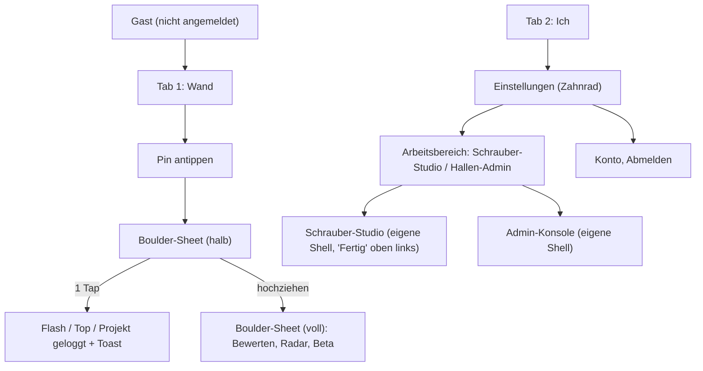

# SPEC-020: UX-Overhaul & Design System v2 («Chalk»)

> **Status:** APPROVED  
> **Owner:** Boris  
> **Created:** 2026-10-04  
> **Gültig ab:** Version 2.0 (UX-Overhaul)  
> **Ersetzt:** SPEC-005 (Design System v1)

---

## 1. Ziel & Vision

Das Design System v2 («Chalk») und der zugehörige UX-Overhaul transformieren BoulderMate in eine aufgeräumte, moderne und intuitive Kletter-App nach Apple Human Interface Guidelines (HIG):
- **Leitbild**: *Geordnet · Apple-like · leicht zu bedienen · in 3 Sekunden verständlich*.
- **Radikale Reduktion**: Beseitigung von visuellem Ballast (*Visual Clutter*), doppelter Hallenauswahl, verschachtelter Tab-Navigation, unverständlichen Entwickler-Texten und UUID-Anzeigen.
- **Inhalt im Mittelpunkt**: Das Wandfoto ist das Interface. Steuerelemente schweben als dezente, transparente Overlays.
- **Konsistente Chalk-Proof Daumenzone**: Jede primäre Aktion an der Wand ist einhändig, schnell und mit eingekreideten Fingern in maximal 2 Taps bedienbar.

---

## 2. Design-Tokens & Theme («Chalk»)

Orientiert an modernen iOS-Apps (z. B. Apple Fitness, Apple Karten, Apple Wetter) bricht SPEC-020 bewusst mit der kantigen, monochromen Uppercase-Formensprache aus SPEC-005.

### 2.1 Typografie
- **Schriftfamilie**: `Inter`, `-apple-system`, `BlinkMacSystemFont`, `"SF Pro Text"`, `sans-serif`.
- **Text-Case**: Konsequentes **Sentence case** (kein generisches Uppercase mehr für Fließtext, Buttons oder Labels).
- **Zahlen**: `tabular-nums` für perfekte Ausrichtung von Graden, Zählern und Prozentwerten.
- **Schriftgrößen (4 feste Stufen)**:
  - `Large Title`: **28 px** (font-bold / font-semibold, Zeilenhöhe 34 px)
  - `Title`: **20 px** (font-semibold, Zeilenhöhe 25 px)
  - `Body`: **16 px** (font-normal / font-medium, Zeilenhöhe 22 px)
  - `Caption`: **13 px** (font-normal, Zeilenhöhe 18 px)

### 2.2 Radien & Formensprache
- **Karten / Cards**: `16 px` (`rounded-2xl`)
- **Buttons / Controls**: `12 px` (`rounded-xl`)
- **Bottom Sheets**: `20 px` oben abgerundet (`rounded-t-[20px]`)
- **Pins**: Vollständig kreisrund (`rounded-full`), Mindest-Touch-Target $\ge 36\text{ px}$ (optimal $44\text{ px}$)

### 2.3 Farbpalette «Kreide» (Dark & Light)

> **Update 06.10.2026**: Systemgrau + Chalk Blue ersetzt durch die Palette «Kreide» (warmes Kreideweiß, Graphit, Messing). Grund: Blau/Grün/Gelb kollidierten mit den Grifffarben, und mehrere Paare im hellen Modus verfehlten WCAG AA. Alle Paare unten erreichen AA. Status wird primär über Form gezeigt (⚡ gefüllt, ✓ Häkchen, ◎ Ring), Statusfarben sind bewusst gedämpfte Erdtöne.

| Token | System Dark | System Light | Verwendung |
|---|---|---|---|
| `bg-background` | `#121110` | `#F4F2EE` | App-Hintergrund |
| `bg-surface` | `#1D1C1A` | `#FFFFFF` | Karten, Sheet-Inhalte, Modals |
| `bg-elevated` | `#2A2826` | `#ECE9E3` | Schwebende Pills, Header-Badges, Suche |
| `border-separator` | `#3A3734` | `#DDD8D0` | Subtile Trennungen (nur wo zwingend nötig) |
| `text-primary` | `#F4F2EE` | `#1A1918` | Primäre Überschriften und Texte |
| `text-secondary` | `#A39E96` | `#6B6762` | Subtexte, Zähler, Meta-Angaben |
| `accent` (*Graphit / Kreide*) | `#F4F2EE` | `#1A1918` | Primär-Buttons, aktive Selektoren (Text darauf: `on-accent`) |
| `star` (*Messing*) | `#D4B06A` | `#8C6A2A` | Ausschließlich Sterne und Hallen-Klassiker-Ring |
| `status-success` | `#8DBF95` | `#3F6B45` | Flash/Top-Status, Erfolgs-Toasts, Soft-Grade |
| `status-warning` | `#E0A86A` | `#9A5B1E` | Projekt-Status, Fair-Grade |
| `status-danger` | `#FF7A66` | `#B23A26` | Destruktive Aktionen, Stiff-Grade |

> **Grundsatz**: **Hallenfarben (Grifffarben) sind die einzigen bunten Farben der App.** Alle UI-Elemente halten sich dezent im neutralen Graustufen-/Schwarz-Weiß-Bereich mit gezieltem Einsatz von Chalk Blue.

### 2.4 Trennungen & Materialien
- **Keine harten 1-px-Linien**: Trennung erfolgt durch Flächenfarben (`surface` vs. `background`) und großzügiges Spacing.
- **Dezenter Blur**: `backdrop-blur-md` mit Transparenz (`rgba(28, 28, 30, 0.75)` dark / `rgba(255, 255, 255, 0.8)` light) ausschließlich für schwebende Overlays über dem Wandfoto zur Gewährleistung bester Lesbarkeit.

### 2.5 Ikonografie & Haptik
- **Icons**: Lucide Icons, einheitlich `22 px` Größe, `stroke-width: 1.75`.
- **Motion**: Spring-Animationen (iOS-Physik) mit `200–300 ms` Dauer. Respektiert `prefers-reduced-motion: reduce`.
- **Haptik**: `navigator.vibrate(10)` auf unterstützten Mobilgeräten (Android) bei erfolgreichem Loggen (`Flash`/`Top`).

### 2.6 Auto-Theme (prefers-color-scheme)
- Die App wechselt vollautomatisch zwischen Dark und Light Mode anhand der Systemeinstellung des Betriebssystems (`prefers-color-scheme`).
- Kein manueller Umschalter in der Haupt-UI – in hellen Hallen bietet der helle Modus optimale Ablesbarkeit gegen Sonnenblendung, bei gedämpftem Licht schont der dunkle Modus die Augen.

---

## 3. Informationsarchitektur

### Die 4 Grundsätze der Architektur:
1. **Zwei Haupt-Tabs für Kletterer**: Die Bottom-Nav enthält exklusiv `Wand` und `Ich`. Login/Nickname oder Modus-Wechsler sind keine Tabs.
2. **Ein Ort pro Funktion**:
   - Hallenauswahl: Exklusiv oben im Header der Wand-Ansicht (`6a plus ▾`).
   - Arbeitsbereichswechsel: Exklusiv über `Ich → Einstellungen (Zahnrad) → Arbeitsbereich`.
   - Login / Authentifizierung: Über die Landing-Page bzw. per Prompt beim Versuch, als Gast zu loggen.
3. **Kein Pflicht-Gateway nach Login**: Nach der Anmeldung startet der Nutzer direkt in seinem zuletzt genutzten Bereich.
4. **Shells mit «Fertig»-Schaltfläche**: Schrauber-Studio und Hallen-Admin laufen in eigenen Shells ohne Kletterer-Bottom-Nav und werden über «Fertig» (oben links) verlassen.

---

## 4. Akzeptanzkriterien (Screens 5.1 – 5.7)

### AC-1: Wand-Ansicht (Kletterer-Home & Edge-to-Edge Foto)
- **AC-1.1**: Das Wandfoto füllt die gesamte Bildschirmbreite und nimmt mindestens **70 % der Viewport-Höhe** (bei iPhone 390×844) ein.
- **AC-1.2**: Der Top-Header schwebt dezent mit Blur über dem Foto (Höhe 44 px) und enthält ausschließlich den Hallenwähler (`[Hallenname] ▾`), ein Ortungs-Icon sowie ein dezentes Info-Icon.
- **AC-1.3**: Ein Tap auf den Hallenwähler öffnet ein modales Sheet mit Suchfeld, aktuellen Favoriten und der Liste aller Hallen.
- **AC-1.4**: Es gibt keine doppelte Hallenanzeige, keine redundanten Hinweistexte («Tippe auf einen Pin…») und keine Entwickler-Statusleisten im Produktions-Build.

### AC-2: Sektorwahl per Wischgeste & Sektor-Pill
- **AC-2.1**: Ein horizontales Wischen (Swipe links/rechts) auf dem Wandfoto wechselt flüssig zum nächsten bzw. vorherigen Sektor.
- **AC-2.2**: Am unteren Rand des Fotos schwebt eine kompakte Sektor-Pill (`‹ [Sektorname] · X/Y ›`).
- **AC-2.3**: Ein Tap auf die Sektor-Pill öffnet ein Bottom Sheet mit einer visuellen Thumbnail-Liste aller Sektoren der aktuellen Halle. Die alte Leiste mit bis zu 17 statischen Chips entfällt ersatzlos.

### AC-3: Filterzeile & Peek-Routenliste
- **AC-3.1**: Direkt unter dem Foto befindet sich eine horizontal scrollbare Filterzeile mit genau 4 Chips: `Alle`, `★ Top`, `Neu`, `Noch offen`.
- **AC-3.2**: Die Routenliste ist als **Peek-Bottom-Sheet** (nach Apple-Maps-Vorbild) am unteren Bildschirmrand verankert und lässt sich flüssig nach oben aufziehen.
- **AC-3.3**: Routeneinträge in der Liste sind als kompakte `ListRow` gestaltet: Farbindikator (Kreis), Bouldername / Schwierigkeitsband, Sternedurchschnitt (`★ X.X`) und persönlicher Begehungsstatus.

### AC-4: Chalk-Proof Pins & Cluster-Auflösung
- **AC-4.1**: Jeder Pin auf der Wand besitzt eine Touch-Trefferfläche von mindestens $36\times 36\text{ px}$.
- **AC-4.2**: Überlappen sich Pins bei dichter Schraubweise, fasst ein Cluster-Algorithmus diese zusammen. Ein Tap auf den Cluster zoomt den Ausschnitt heran oder fächert die betroffenen Boulder als Mini-Menü auf, um Fehlklicks zuverlässig zu verhindern.
- **AC-4.3**: Der persönliche Kletterstatus wird direkt am Pin visualisiert:
  - Getoppt: gefüllter Kreis mit Häkchen (✓)
  - Projekt: markanter offener Ring
  - Ungeloggt: solider Farbpin
- **AC-4.4**: Ein leuchtender Favoriten-Ring («Hallen-Klassiker») wird exklusiv an die Top-3-bestbewerteten Boulder des Sektors vergeben.

### AC-5: Einheitliches Boulder-Sheet & 2-Tap-Logging Flow
- **AC-5.1**: `BoulderBottomSheet`, `BoulderDetailModal` und `RatingModal` werden vollständig in einer einzigen responsiven Komponente `BoulderSheet` konsolidiert.
- **AC-5.2**: **Halb geöffneter Zustand (Standard)**:
  - Zeigt Farb-Badge, Boulder-Name, Schwierigkeitsgrad, Charakteristik und Sterne-Schnitt.
  - Zeigt in der unteren Daumenzone drei große, kreidetaugliche Buttons (Höhe 64 px): `⚡ Flash`, `✓ Top`, `◎ Projekt`.
- **AC-5.3**: Ein Tap auf einen der drei Buttons speichert die Begehung sofort in Supabase (`ascents`), löst eine kurze Haptik (`navigator.vibrate(10)`) aus, schließt das Sheet ohne Verzögerung und kehrt zur Wand zurück.
- **AC-5.4**: Ein nicht-blockierender Toast («Top geloggt · Rückgängig») bestätigt den Durchstieg für 4 Sekunden und bietet:
  - Einen «Rückgängig»-Button zur sofortigen Stornierung des Logs.
  - Ein optionales Inline-Mini-Rating (`Wie war's? ★★★★★`), mit dem eine Qualitätswertung in genau einem weiteren Tap abgegeben werden kann.

### AC-6: Boulder-Sheet Voll-Ansicht & Detailinformationen
- **AC-6.1**: Zieht der Nutzer das Sheet ganz nach oben, werden die vertiefenden Details sichtbar:
  - Community-Einschätzung (Sterne-Schnitt + Segmented Bar *Soft / Fair / Stiff*)
  - 5-Achsen-Klettercharakter-Radar (Kraft, Technik, Balance, Koordination, Flexibilität)
  - Beta-Talk & Matten-Kommentare
  - Schaltfläche «Meine Bewertung anpassen»
- **AC-6.2**: Der Routenbauer wird namentlich dargestellt (mit Fallback «Hallenteam»); UUIDs werden niemals im Interface angezeigt.
- **AC-6.3**: Das Löschen eigener Logs oder Bewertungen ist ausschließlich über ein dezent platziertes «…»-Menü möglich.
- **AC-6.4**: **Kein Routen-Löschen im Kletterer-Bereich**: Routen können im Kletterer-Sheet unter keinen Umständen dauerhaft gelöscht werden (AC-13 aus SPEC-003 ist ersatzlos gestrichen).

### AC-7: «Ich»-Seite (Kompakter persönlicher Bereich)
- **AC-7.1**: Die Seite besteht aus genau einer scrollbaren Ansicht **ohne verschachtelte Unter-Tabs** (die Trennung in Overall/Deep-Dive entfällt).
- **AC-7.2**: **Header**: Zeigt Avatar, Nickname (mit sauberem Umbruch / Truncation bei langen Namen) sowie das Zahnrad für Einstellungen.
- **AC-7.3**: **Hallenfilter**: Kleiner Segmented Control `Diese Halle | Alle` am oberen Seitenrand.
- **AC-7.4**: **Hero-Zahlen**: Drei große KPI-Zahlen: `Tops`, `Flash-Quote` und `Bester Grad`.
- **AC-7.5**: **Grad-Pyramide**: Visualisiert ausschließlich gekletterte Grade $\pm 1$ Nachbargrad; leere Zeilen für ungekletterte Grade werden ausgeblendet.
- **AC-7.6**: **Dein Stil (5-Achsen-Radar)**: Zeigt ab 5 Begehungen das persönliche Athletenprofil inklusive automatischer Text-Auswertung (z. B. «Stärke: Technik · Baustelle: Kraft»). Unterhalb von 5 Begehungen wird ein dezenter Fortschrittsbalken gerendert («Noch X Tops bis zu deinem Stil-Profil»).
- **AC-7.7**: **Session-Verlauf**: Gruppierte Liste der Aktivitäten nach Session/Datum (Apple-Fitness-Stil). Ein Tap auf einen Eintrag öffnet das zugehörige `BoulderSheet`.

### AC-8: Einstellungen & Arbeitsbereichswechsel
- **AC-8.1**: Einstellungen öffnen sich modal über das Zahnrad im «Ich»-Header.
- **AC-8.2**: Übersichtliche Gruppen im iOS-Settings-Stil:
  - **Profil**: Nickname, Profilfoto
  - **Halle**: Heimhalle festlegen
  - **Arbeitsbereich**: Wechsel zu «Schrauber-Studio» bzw. «Hallen-Admin» (nur sichtbar für berechtigte Rollen)
  - **Daten**: JSON-Backup und Export
  - **Konto**: Abmelden, Konto löschen
- **AC-8.3**: Das Pflicht-Role-Gateway nach Login entfällt. Die App merkt sich den zuletzt geöffneten Bereich dauerhaft.

### AC-9: Landing-Page & Gast-Zugang
- **AC-9.1**: Die Landing-Page ist auf einen einzigen Screen komprimiert: Prägnanter Claim, 3 visuelle Feature-Punkte, Buttons `Mit Apple / Google fortfahren` sowie `Ohne Konto umsehen`.
- **AC-9.2**: Unangemeldete Besucher können über `Ohne Konto umsehen` die Wandansicht und Sektoren im **Read-only-Modus** frei erkunden.
- **AC-9.3**: Versucht ein Gast, einen Boulder zu loggen oder zu bewerten, öffnet sich ein Login-Sheet zur Anmeldung.
- **AC-9.4**: Test-Personas und Quick-Login-Buttons werden streng hinter `import.meta.env.DEV` verborgen und dürfen im Produktions-Build nicht vorhanden sein.

### AC-10: Schrauber-Studio (Schnellerfassung & «Auswählen»-Modus)
- **AC-10.1**: Läuft in einer eigenständigen Shell mit Header `Studio · [Hallenname]` und markantem **«Fertig»**-Button oben links zur Rückkehr.
- **AC-10.2**: Sektorauswahl als übersichtliche Liste/Sheet mit Thumbnails und Entwurfs-Status («X neue Entwürfe»).
- **AC-10.3**: Schnellerfassungs-Sheet: Ein Tap auf das Wandfoto öffnet das Formular mit **nur der Farbe als Pflichtfeld** und dem Button «Weiter zum nächsten». Name und 5-Achsen-Radar befinden sich eingeklappt unter «Details (optional)». Ziel: 8 Boulder in unter 3 Minuten erfassen.
- **AC-10.4**: **«Auswählen»-Modus**: Zum Bearbeiten, Archivieren oder Löschen mehrerer Boulder tippt der Schrauber auf «Auswählen» und markiert die Pins einzeln (keine Desktop-CAD-Rechteckauswahl).
- **AC-10.5**: Foto-Upload unterstützt ausschließlich «Foto aufnehmen» (Kamera) und «Aus Mediathek» (Datei). Presets und URL-Uploads entfallen.
- **AC-10.6**: Veröffentlichen-Leiste am unteren Bildschirmrand fasst Änderungen zusammen («X Änderungen · Veröffentlichen»).

### AC-11: Hallen-Admin-Konsole
- **AC-11.1**: Eigenständige Shell mit «Fertig»-Schaltfläche zur Rückkehr.
- **AC-11.2**: Strukturierte Ansicht mit 3 Sektionen: `Sektoren`, `Farben & Grade`, `Team`.
- **AC-11.3**: Sektor-Reordering erfolgt über einen mobilen Sortiermodus mit Drag-Handles (iOS-Listenstil); Desktop-Pfeil-Buttons entfallen.

---

## 5. Erfolgskriterien & Verifikation

| Kriterium | Metrik / Verifikationsmethode |
|---|---|
| **Wandfoto-Höhe** | Wandfoto nimmt $\ge 70\,\%$ der Viewport-Höhe bei 390×844 ein (Playwright BoundingBox Assertion). |
| **2-Tap-Logging** | Boulder loggen in $\le 2$ Taps ab Wandansicht (E2E: Pin $\rightarrow$ Top $\rightarrow$ Toast sichtbar, Supabase `ascents` HTTP 201). |
| **Pin-Treffsicherheit** | Keine überlappenden Touch-Ziele durch Cluster-Algorithmus (Unit- und E2E-Test). |
| **Flache Navigation** | Maximal 1 Navigationsebene pro Screen (keine verschachtelten Sub-Tabs). |
| **Single-Source Navigation** | Hallenwahl, Rollenwechsel und Login existieren jeweils an exakt einem Ort in der gesamten App. |
| **Produktions-Sauberkeit** | Keine Seed-, Mock- oder Persona-Daten im Produktions-Build (`AVAILABLE_CLIMBERS`, `SEED_` nicht auffindbar im Dist-Bundle). |
| **Schrauber-Geschwindigkeit** | 8 Boulder an einer Wand in $< 3$ Minuten im Schnellerfassungs-Flow erfasst. |
| **Barrierefreiheit & Kontrast** | WCAG AA Konformität im automatischen Dark- und Light-Mode (axe-core via Playwright). |
| **Regressions-Sicherheit** | Bestehende Test-Suiten grün (`npm test -- --run`, Playwright). |
| **Testpflicht** | Jedes AC dieser Spec ist durch einen Unit-Test **und** einen Playwright-Test abgedeckt (CONSTITUTION §13). |

---

## 5a. Umsetzungsstand (06.10.2026)

| Bereich | Stand | Tests |
|---|---|---|
| §2.3 Palette «Kreide» (hell + dunkel, WCAG AA, keine fest codierten Farben, Radar über Tokens) | umgesetzt | `tests/spec020RedesignKreide.test.tsx`, `tests/e2e/redesign-kreide.spec.ts` |
| AC-1.4 keine redundanten Hinweistexte, kein Entwickler-Footer | umgesetzt (Wand-Hinweise, «Filter:», «Sortierung:», SPEC-005-Footer entfernt) | dito |
| AC-3.1 Filter-Chips | teilweise: `Alle`, `Top`, `Beliebt`, `Projekte` (statt `Neu`, `Noch offen`) | `tests/spec003Components.test.tsx` |
| AC-6.1 / AC-6.2 Schrauber-Name statt UUID, Fallback «Hallenteam», «Charakter»-Radar, keine Emoji-Legende | umgesetzt im `BoulderDetailModal` | `tests/spec020RedesignKreide.test.tsx`; E2E in `tests/e2e/climber-ux.spec.ts` (SPEC-022) |
| AC-7.4 / AC-7.5 KPIs ohne Erklär-Untertitel, nur gekletterte Grade | umgesetzt in `ProfileKPIsBar` und `GradeDistributionChart` | `tests/spec020RedesignKreide.test.tsx` |
| Tab «Ich» | umgesetzt in `MobileBottomNav` | Unit; E2E in `tests/e2e/climber-ux.spec.ts` (SPEC-022) |
| AC-9.1 Landing auf einem Screen (≤ 40 Wörter) | umgesetzt mit `Konto erstellen` / `Als Kletterer testen` (Apple/Google-Login und `Ohne Konto umsehen` noch offen) | Unit + Playwright (kein Scrollen) |
| AC-9.4 Personas nur im Dev-Build, kein Standardpasswort | umgesetzt (Landing + Login-Modal, Passwort ≥ 6 Zeichen) | `tests/spec020RedesignKreide.test.tsx`, `tests/landingPage.test.tsx` |
| AC-1.1 Wandfoto ≥ 70 %, AC-2 Sektor-Pill, AC-5 `BoulderSheet`, AC-7.1 `MeView` ohne Sub-Tabs, doppelte Hallenwahl | offen (`BoulderSheet.tsx` und `MeView.tsx` existieren, sind aber nicht eingebunden) | beim Einbau Unit + Playwright ergänzen |

## 6. Out-of-Scope (Zurückgestellt / ON HOLD)

Die folgenden Themen sind bewusst **nicht** Bestandteil von SPEC-020 und bleiben bis zur vollständigen Stabilisierung des UX-Kerns zurückgestellt:
- **SPEC-010 (Spatial 2.5D Gyro-Parallax Wall Depth)**: Auf ON HOLD gesetzt.
- **SPEC-012 (Turniere & Boulder Jam Events)**: Auf ON HOLD gesetzt.
- **IDEA-004 (Boulder-Fit-Engine)**: Backlog.
- **Erweiterte GNPI-Detailmathematik**: Zurückgestellt, Fokus liegt auf der vereinfachten 5-Achsen-Darstellung.
